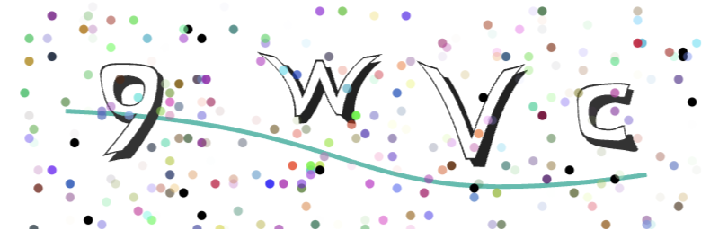
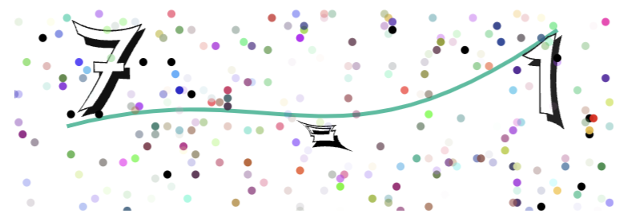

# Go SVG Captcha

> Package captcha provides an easy to use

<div>
  
[](https://pkg.go.dev/github.com/reu98/go-svg-captcha)
[](https://github.com/reu98/go-svg-captcha/actions?workflow=go-svg-captcha-ci)
[](https://codecov.io/gh/reu98/go-svg-captcha)
[](https://goreportcard.com/report/github.com/reu98/go-svg-captcha)

</div>

## Why did I create another SVG captcha package?

I want a simple package. It should be flexible and not rely on rendering images but rather return HTML SVG code.

## Install

```
    go get -u github.com/reu98/go-svg-captcha
```

## Usage

```Go
    import captcha "github.com/reu98/go-svg-captcha"

    func main() {
        option := captcha.OptionText
        result, err := captcha.CreateByText(option)
        if err != nil {
            log.Fatalln(err)
        }

        // Text
        fmt.Printf("Text: %v", (*result).Text)

        // HTML SVG
        fmt.Printf("SVG: %v", (*result).Data)
    }
```

[Documentation](https://pkg.go.dev/github.com/reu98/go-svg-captcha) |
[Example Basic](examples/basic/main.go)

## Sample image




## Compatibility

This package uses embedding from Go 1.21. If you're using a version before 1.21, please upgrade to 1.21 to utilize this package.

## Changelog

[Changelog](CHANGELOG.md)

## Contributing

If your found a bug, please contribute!
see [contributing.md](CONTRIBUTING.md) for more detail.

## License

[MIT](LICENSE)

## Roadmap

- [ ] Finish [Documentation](https://pkg.go.dev/github.com/reu98/go-svg-captcha)
- [ ] Generate multiple captchas
- [ ] Write image
- [ ] Upload the image to the cloud
- [ ] Create a captcha storage to use with the API
